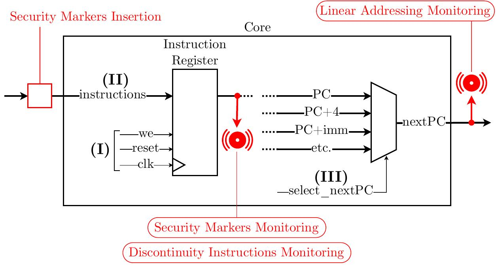

# Unprotected OpenHW Group CORE-V CV32E40P IP

[CV32E40P](https://github.com/openhwgroup/cv32e40p/) is a small and efficient, 32-bit, in-order RISC-V core with a 4-stage pipeline that implements
the RV32IM\[F\]C instruction set architecture. It started its life as a fork of the OR10N CPU core that is based on the OpenRISC ISA. Then, under the name of RI5CY, it became a RISC-V core (2016), and it has been maintained
by the [PULP platform](https://www.pulp-platform.org/) team until February 2020,
when it has been contributed to [OpenHW Group](https://www.openhwgroup.org/).

All necessary documentation is available [here](https://github.com/openhwgroup/cv32e40p/).

## Branches 
Four branches are available :
- **init_cv32e40p** : fork without modification of the [CV32E40P](https://github.com/openhwgroup/cv32e40p/) from its [release](https://github.com/openhwgroup/cv32e40p/releases/tag/cv32e40p_v1.0.0).
- **lam_cv32e40p** : one monitor of *Linear Addressing Monitoring* countermeasure is implemented.
- **smm_cv32e40p** : one monitor of *Security Marker Monitoring* countermeasure and one hardware insertion of security marker are implemented.
- **dim_cv32e40p** : one monitor of *Discontinuity Instruction Monitoring* countermeasure and one hardware insertion of security marker are implemented.

## Countermeasure implementation

Each hardware block is described in one file :
- **rtl/cv32e40p_insert_security_markers.sv**
- **rtl/cv32e40p_lce_detector.sv**

There are located according to the following diagram.

    

